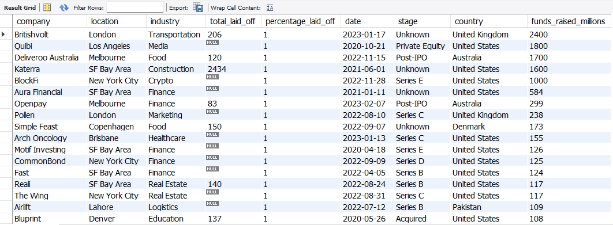
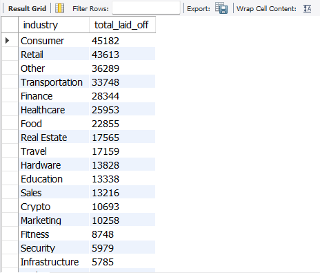
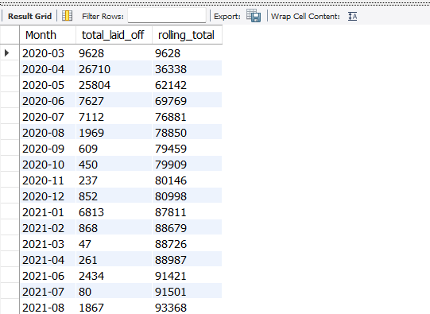
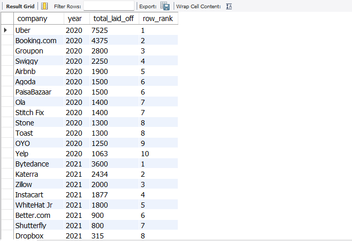
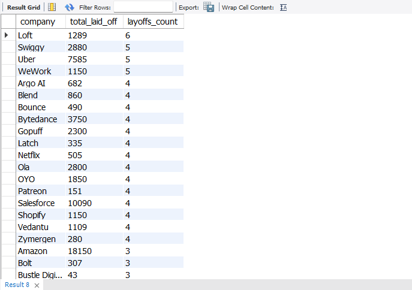

# Global Layoffs Exploratory Data Analysis Using SQL


## About The Project

This project focuses on performing an **Exploratory Data Analysis (EDA)** on a global layoffs dataset using **MySQL**. I explored workforce reduction patterns across companies, industries, countries, locations, and company growth stages to better comprehend how layoffs evolved over time.

---

## Project Objectives

* Perform exploratory data analysis using SQL
* Analyze layoff trends from multiple perspectives
* Identify patterns and anomalies within the dataset
* Practice writing analytical SQL queries
* Apply aggregate functions, CTEs, and window functions
* Extract insights that answer real-world business questions

---

## Exploratory Analysis & Key SQL Queries

### 1. Dataset Overview

**Question**

What is the time period covered by the dataset, and what are the largest recorded layoff events?

**Key Insights**

- The dataset covers layoff events from **March 11, 2020** to **March 6, 2023**, spanning approximately three years.
- The **largest single layoff event** affected **12,000 employees**.
- The maximum `percentage_laid_off` recorded is **1 (100%)**, indicating complete workforce reductions for some companies.

**Key SQL Queries**

```sql
SELECT MIN(`date`) AS minimum_date,
       MAX(`date`) AS maximum_date
FROM layoffs_prac2;

SELECT MAX(total_laid_off) AS max_total_laid_off,
       MAX(percentage_laid_off) AS max_percentage_laid_off
FROM layoffs_prac2;
```

---

### 2. Companies That Completely Shut Down

**Question**

Which companies laid off their entire workforce?

**Key Insights**

Several companies reported **100% layoffs**, indicating complete business shutdowns.

Some notable examples include:

| Company | Industry | Country | Funds Raised (Millions) |
|---------|----------|----------|-------------------------:|
| Britishvolt | Transportation | United Kingdom | 2400 |
| Quibi | Media | United States | 1800 |
| Deliveroo Australia | Food | Australia | 1700 |
| Katerra | Construction | United States | 1600 |
| BlockFi | Crypto | United States | 1000 |

These findings show that companies across multiple industries ceased operations entirely despite operating in different markets.

**Key SQL Query**

```sql
SELECT *
FROM layoffs_prac2
WHERE percentage_laid_off = 1
ORDER BY funds_raised_millions DESC;
```

---

### 3. Companies That Shut Down Despite Raising Significant Funding

**Question**

Did companies with substantial funding still fail?

**Key Insights**

Several companies that raised hundreds of millions—or even billions—of dollars still shut down completely.

Examples include:

- **Britishvolt** – **$2.4B** raised
- **Quibi** – **$1.8B**
- **Deliveroo Australia** – **$1.7B**
- **Katerra** – **$1.6B**
- **BlockFi** – **$1.0B**

These results suggest that strong financial backing alone does not guarantee long-term business success.

**Key SQL Query**

```sql
SELECT *
FROM layoffs_prac2
WHERE percentage_laid_off = 1
ORDER BY funds_raised_millions DESC;
```

---

### 4. Companies With the Highest Layoffs

**Question**

Which companies experienced the largest workforce reductions?

**Key Insights**

The companies with the highest cumulative layoffs were:

| Company | Total Layoffs |
|---------|--------------:|
| Amazon | 18,150 |
| Google | 12,000 |
| Meta | 11,000 |
| Salesforce | 10,090 |
| Microsoft | 10,000 |
| Philips | 10,000 |
| Ericsson | 8,500 |
| Uber | 7,585 |
| Dell | 6,650 |
| Booking.com | 4,601 |

The results highlight that many of the world's largest technology companies underwent significant workforce reductions.

**Key SQL Query**

```sql
SELECT company,
SUM(total_laid_off) AS total_laid_off
FROM layoffs_prac2
GROUP BY company
ORDER BY total_laid_off DESC;
```

---

### 5. Industries Most Affected

**Question**

Which industries experienced the highest number of layoffs?

**Key Insights**

The **Consumer** industry recorded the highest number of layoffs with **45,182 employees**, followed by:

- Retail — **43,613**
- Other — **36,289**
- Transportation — **33,748**
- Finance — **28,344**
- Healthcare — **25,953**

These findings indicate that consumer-facing industries were among the hardest hit during the period analyzed.

**Key SQL Query**

```sql
SELECT industry,
SUM(total_laid_off) AS total_laid_off
FROM layoffs_prac2
GROUP BY industry
ORDER BY total_laid_off DESC;
```

---

### 6. Countries Most Affected

**Question**

Which countries reported the highest number of layoffs?

**Key Insights**

The **United States** recorded **256,559 layoffs**, significantly higher than every other country.

The next highest were:

- India — **35,993**
- Netherlands — **17,220**
- Sweden — **11,264**
- Brazil — **10,391**

This suggests that workforce reductions were heavily concentrated in the United States throughout the study period.

**Key SQL Query**

```sql
SELECT country,
SUM(total_laid_off) AS total_laid_off
FROM layoffs_prac2
GROUP BY country
ORDER BY total_laid_off DESC;
```

---

### 7. Locations With the Highest Layoffs

**Question**

Which cities or regions experienced the largest workforce reductions?

**Key Insights**

The **San Francisco Bay Area** recorded the highest layoffs with **125,631 employees**, followed by:

- Seattle — **34,743**
- New York City — **29,364**
- Bengaluru — **21,787**
- Amsterdam — **17,140**

The results show that major technology hubs experienced the greatest workforce reductions.

**Key SQL Query**

```sql
SELECT location,
SUM(total_laid_off) AS total_laid_off
FROM layoffs_prac2
GROUP BY location
ORDER BY total_laid_off DESC;
```

---

### 8. Layoffs by Company Growth Stage

**Question**

Which company growth stages experienced the highest layoffs?

**Key Insights**

Companies that had already gone **Post-IPO** accounted for **204,132 layoffs**, the highest among all funding stages.

They were followed by:

- Unknown — **40,716**
- Acquired — **27,576**
- Series C — **20,017**
- Series D — **19,225**

This indicates that publicly traded companies experienced the largest workforce reductions.

**Key SQL Query**

```sql
SELECT stage,
SUM(total_laid_off) AS total_laid_off
FROM layoffs_prac2
GROUP BY stage
ORDER BY total_laid_off DESC;
```

---

### 9. Monthly Layoff Trend

**Question**

How did layoffs change over time?

**Key Insights**

Layoffs increased rapidly during the early months of the pandemic.

- March 2020 — **9,628 layoffs**
- April 2020 — **26,710 layoffs**
- May 2020 — **25,804 layoffs**

By **June 2021**, the rolling cumulative layoffs had exceeded **91,421 employees**, demonstrating the long-term impact of workforce reductions.

**Key SQL Query**

```sql
WITH rolling_total AS
(
SELECT SUBSTRING(`date`,1,7) AS month,
SUM(total_laid_off) AS total_laid_off
FROM layoffs_prac2
WHERE SUBSTRING(`date`,1,7) IS NOT NULL
GROUP BY month
ORDER BY month
)

SELECT month,
total_laid_off,
SUM(total_laid_off)
OVER(ORDER BY month) AS rolling_total
FROM rolling_total;
```

---

### 10. Top 10 Companies by Layoffs Each Year

**Question**

Which companies recorded the largest layoffs each year?

**Key Insights**

The highest-ranking companies by total layoffs were:

- **2020:** Uber (**7,525**)
- **2021:** Bytedance (**3,600**)
- **2022:** Meta (**11,000**)
- **2023:** Google (**12,000**)

The rankings illustrate how the companies most affected changed from year to year.

**Key SQL Query**

```sql
WITH company_year AS
(
SELECT company,
YEAR(`date`) AS years,
SUM(total_laid_off) AS total_laid_off
FROM layoffs_prac2
GROUP BY company, years
),

company_rank AS
(
SELECT *,
DENSE_RANK() OVER(PARTITION BY years ORDER BY total_laid_off DESC) AS ranking
FROM company_year
)

SELECT *
FROM company_rank
WHERE ranking <= 10;
```

---

### 11. Top Industries by Year

**Question**

Which industries experienced the most layoffs each year?

**Key Insights**

The leading industry changed over time:

- **2020:** Transportation (**14,656 layoffs**)
- **2021:** Consumer (**3,600 layoffs**)
- **2022:** Retail (**20,914 layoffs**)
- **2023:** Other (**28,512 layoffs**)

This demonstrates how the industries most affected shifted as economic conditions evolved.

**Key SQL Query**

```sql
WITH industry_year AS
(
SELECT industry,
YEAR(`date`) AS years,
SUM(total_laid_off) AS total_laid_off
FROM layoffs_prac2
GROUP BY industry, years
),

industry_rank AS
(
SELECT *,
DENSE_RANK() OVER(PARTITION BY years ORDER BY total_laid_off DESC) AS ranking
FROM industry_year
)

SELECT *
FROM industry_rank
WHERE ranking <= 10;
```

---

### 12. Top Countries by Year

**Question**

Which countries recorded the highest layoffs each year?

**Key Insights**

The **United States** ranked first every year:

- **2020:** 50,385 layoffs
- **2021:** 9,470 layoffs
- **2022:** 106,520 layoffs
- **2023:** 89,684 layoffs

This indicates that the United States consistently experienced the highest workforce reductions throughout the analysis period.

**Key SQL Query**

```sql
WITH country_year AS
(
SELECT country,
YEAR(`date`) AS years,
SUM(total_laid_off) AS total_laid_off
FROM layoffs_prac2
GROUP BY country, years
),

country_rank AS
(
SELECT *,
DENSE_RANK() OVER(PARTITION BY years ORDER BY total_laid_off DESC) AS ranking
FROM country_year
)

SELECT *
FROM country_rank
WHERE ranking <= 10;
```

---

### 13. Companies With Multiple Rounds of Layoffs

**Question**

Which companies conducted layoffs multiple times?

**Key Insights**

Several organizations implemented multiple rounds of layoffs instead of a single workforce reduction.

The highest were:

| Company | Layoff Rounds | Total Employees Laid Off |
|---------|--------------:|-------------------------:|
| Loft | 6 | 1,289 |
| Swiggy | 5 | 2,880 |
| Uber | 5 | 7,585 |
| WeWork | 5 | 1,150 |

These repeated layoff events suggest prolonged restructuring efforts rather than one-time organizational changes.

**Key SQL Query**

```sql
SELECT company,
SUM(total_laid_off) AS total_laid_off,
COUNT(company) AS layoff_rounds
FROM layoffs_prac2
GROUP BY company
HAVING COUNT(company) > 1
ORDER BY layoff_rounds DESC, total_laid_off DESC;
```

---

## Some Project Screenshots

### Companies That Shut Down Despite Raising Significant Funding

<p align="center">

</p>

### Layoffs By Industry

<p align="center">

</p>

### Monthly Trend With Rolling Total

<p align="center">

</p>

### Top 10 companies with the largest layoffs each year

<p align="center">

</p>

### Companies With Multiple Rounds of Layoffs

<p align="center">

</p>

---

## Summary

- The dataset covers global layoffs from **March 11, 2020** to **March 6, 2023**.
- **Amazon** recorded the highest cumulative layoffs (**18,150 employees**).
- The **Consumer** industry (**45,182 layoffs**) and the **United States** (**256,559 layoffs**) were the most affected.
- Public companies (**Post-IPO**) accounted for the largest share of layoffs (**204,132 employees**).
- Several well-funded companies, including **Britishvolt**, **Quibi**, and **Katerra**, shut down despite raising significant investment.

---

## SQL Concepts Applied

| Category                 | SQL Concepts                        |
| ------------------------ | ----------------------------------- |
| Aggregation              | SUM(), MIN(), MAX(), COUNT()        |
| Filtering                | WHERE, HAVING                       |
| Grouping                 | GROUP BY                            |
| Sorting                  | ORDER BY                            |
| Date Functions           | YEAR(), SUBSTRING()                 |
| Common Table Expressions | WITH (CTEs)                         |
| Window Functions         | SUM() OVER(), DENSE_RANK()          |
| Ranking                  | DENSE_RANK()                        |
| Time-Series Analysis     | Yearly and Monthly Trends           |

---

## Built With

| Technology | Purpose                                    |
| ---------- | ------------------------------------------ |
| MySQL      | Data storage and analysis                  |
| SQL        | Querying and exploratory analysis          |
| GitHub     | Project hosting and portfolio presentation |

---

## Dataset Files

| File | Description |
|------|-------------|
| `layoffs.csv` | Original raw Global Layoffs dataset downloaded from [Kaggle](https://www.kaggle.com/datasets/swaptr/layoffs-2022). |
| `layoffs_cleaned.csv` | Cleaned and analysis-ready dataset generated from my previous project, **SQL Data Cleaning: Global Layoffs Dataset**, and used for this exploratory analysis. |
